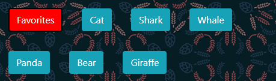
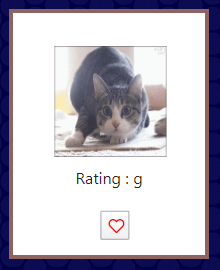

# giphyMatt

Use giphyMatt to find some cool gifs within certain topics! 
 giphyMatt default buttons are all animals but feel free to search other topics.

# How to use Giphy Matt

* Click any of the pre-made buttons to show 10 gifs of its category.

* Add another button by typing and animal in the search box and click Submit.

* If you like any of the gifs click the heart to save it to your favorites. It will be solid red when it is added to favorites.

 

* You can view your favorites by clicking on the red favorites button.

* Enjoy your gifs! This one is my favorite! 

